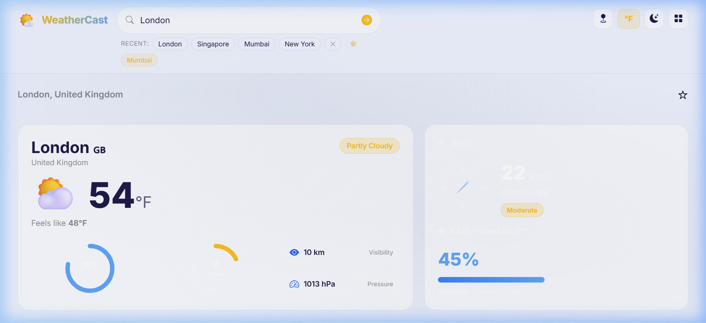
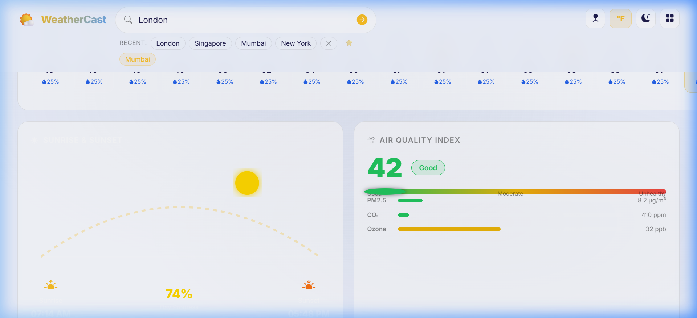
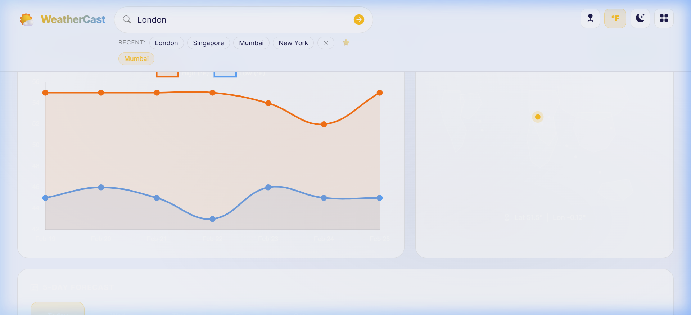
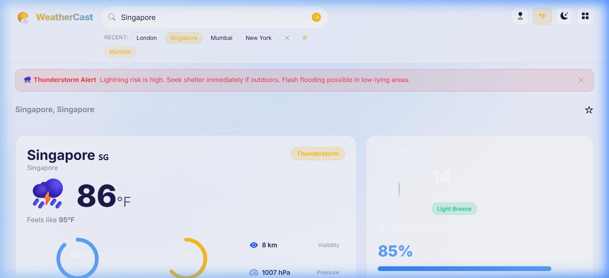
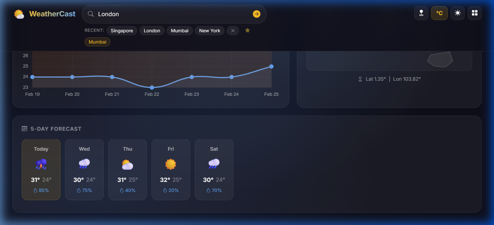
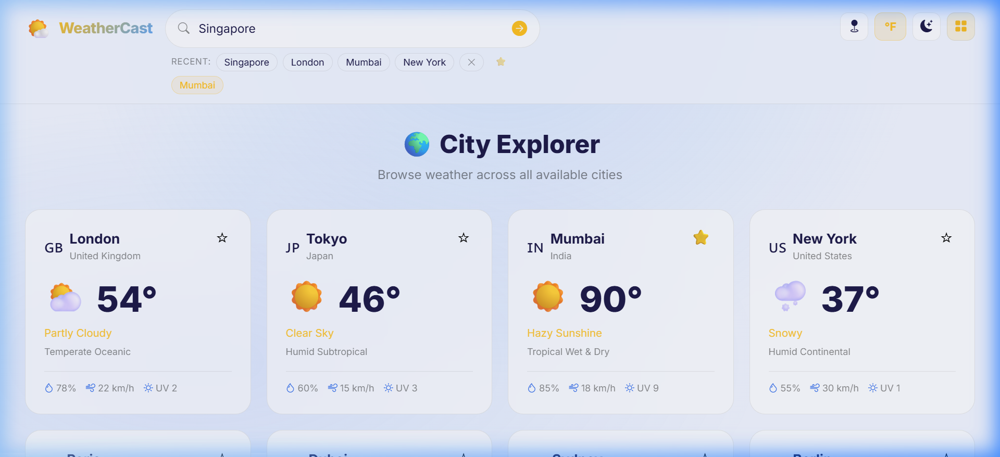
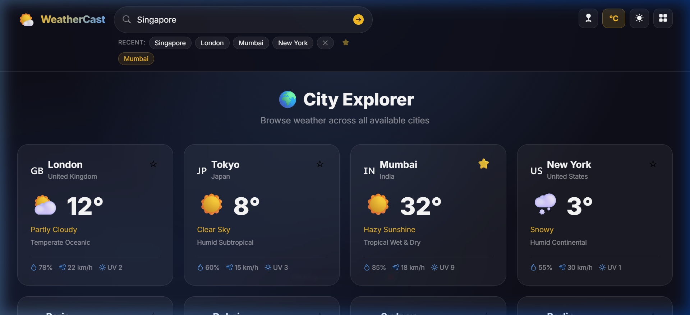

# WeatherCast – Weather Forecast App Walkthrough

## What Was Built

A fully-featured **Weather Forecast Angular Application** with a premium dark glassmorphism design, delivering all required features using **mock data** (no API key needed).

---

## Features Delivered

| Feature | Status |
|---|---|
| City search with autocomplete | ✅ |
| Current weather (temp, humidity, UV, pressure, visibility) | ✅ |
| Wind speed, direction & compass widget | ✅ |
| Rain probability animated bar | ✅ |
| Sunrise & sunset SVG arc with day progress % | ✅ |
| 5-day forecast strip with icons, high/low temps | ✅ |
| SVG climate map with pulsing city pin | ✅ |
| "City not found" error state | ✅ |
| Responsive design (mobile + desktop) | ✅ |
| Loading spinner for async feel | ✅ |
| Fuzzy city search matching | ✅ |
| °C / °F unit toggle (persists on reload) | ✅ |
| Dark / Light theme toggle (persists on reload) | ✅ |
| Recent search history chips | ✅ |
| Favourite cities (⭐ bookmark) | ✅ |
| 24-hour hourly forecast strip | ✅ |
| Air Quality Index (AQI) panel | ✅ |
| 7-day historical temperature chart (Chart.js) | ✅ |
| SVG circular progress rings (Humidity & UV) | ✅ |
| Weather alert dismissable banners | ✅ |
| Animated condition-based backgrounds (sunny/rain/snow) | ✅ |
| City URL routing `/weather/:city` | ✅ |
| `/explore` City Explorer card grid | ✅ |
| Geolocation – "Use My Location" button | ✅ |
| Accessibility (ARIA labels, keyboard nav) | ✅ |

---

## Architecture

```
src/app/
├── models/
│   └── weather.model.ts          ← TypeScript interfaces
├── services/
│   ├── weather.service.ts        ← Mock data for 10 cities + fuzzy search
│   ├── search.service.ts         ← BehaviorSubject city stream
│   ├── settings.service.ts       ← °C/°F unit + dark/light theme
│   ├── favourites.service.ts     ← Favourite cities (localStorage)
│   └── history.service.ts        ← Recent search history (localStorage)
├── navbar/                       ← Search, unit toggle, theme toggle, geo, chips
├── home/                         ← Dashboard orchestrator
└── components/
    ├── current-weather/          ← Main weather card + SVG rings
    ├── wind-rain/                ← Compass widget + rain probability bar
    ├── sun-times/                ← Animated SVG arc (sunrise → sunset)
    ├── forecast/                 ← 5-day forecast strip
    ├── climate-map/              ← SVG world map + pulsing city pin
    ├── hourly-forecast/          ← 24-hour horizontal scrollable strip
    ├── aqi-panel/                ← Air quality index gauge
    ├── historical-chart/         ← Chart.js 7-day temperature chart
    └── city-explorer/            ← /explore city card grid
```

---

## Available Cities

| City | Country | Climate |
|------|---------|---------|
| London | 🇬🇧 United Kingdom | Temperate Oceanic |
| Tokyo | 🇯🇵 Japan | Humid Subtropical |
| Mumbai | 🇮🇳 India | Tropical Wet & Dry |
| New York | 🇺🇸 United States | Humid Continental |
| Paris | 🇫🇷 France | Oceanic Climate |
| Dubai | 🇦🇪 UAE | Hot Desert |
| Sydney | 🇦🇺 Australia | Humid Subtropical |
| Berlin | 🇩🇪 Germany | Humid Continental |
| Toronto | 🇨🇦 Canada | Humid Continental |
| Singapore | 🇸🇬 Singapore | Tropical Rainforest |

---

## Technologies Used

- **Angular 21** (standalone components)
- **TypeScript**
- **Bootstrap 5** (grid & utilities)
- **Bootstrap Icons**
- **RxJS** (BehaviorSubject, Observable, delay)
- **Chart.js** (7-day historical temperature chart)
- **Vanilla CSS** (glassmorphism, animations, SVG)
- **Google Fonts** (Inter)

---

## Screenshots

### 🏠 London Dashboard – Top (Current Weather, Wind, Hourly Forecast)


### 📊 London Dashboard – Middle (Sunrise/Sunset, AQI Panel)


### 📈 London Dashboard – Bottom (Historical Chart, Climate Map, 5-Day Forecast)


### ⛈️ Singapore – Thunderstorm Alert + Full Dashboard


### 📊 Singapore – Historical Chart & 5-Day Forecast


### 🌍 City Explorer (`/explore`) – All 10 Cities


### 🌙 Dark Mode on Explorer


---

## 🎬 Demo Recording

The video below shows the full app walkthrough — city search, unit toggle, theme switch, weather alerts, and the city explorer:


---

## How to Run

```bash
# Install dependencies
npm install

# Start dev server
ng serve

# Open browser
# Navigate to http://localhost:4200
```

## How to Use

1. App loads with **London** weather by default at `/weather/London`
2. Type any city name in the search bar (e.g. `Mumbai`, `Tokyo`, `Dubai`)
3. Select from the autocomplete dropdown or press **Enter**
4. All panels update dynamically with the city's weather data
5. Toggle **°C/°F** using the pill button in the top-right navbar
6. Toggle **Dark/Light** theme with the 🌙/☀️ button
7. Click **📍** to auto-detect your nearest city via geolocation
8. Click **⊞** to browse all 10 cities on the `/explore` page
9. Star (**☆**) any city to add it to your favourites bar
10. Try an unknown city name to see the friendly "City Not Found" message

---

## Bug Fixes

### Mumbai Search Fix
The initial version had a strict exact-key match in `WeatherService.getWeather()`. Fixed by adding fuzzy matching — searches like `"mum"`, `"MUMBAI"`, or `"Mumb"` all resolve correctly.

```typescript
const matchedKey = Object.keys(MOCK_DATA).find(k =>
  k.includes(key) || key.includes(k)
);
```

### Loading State Fix (Angular Zoneless)
Angular 21 uses zoneless change detection. After the async `delay(400)` RxJS callback, the template wasn't updating. Fixed by injecting `ChangeDetectorRef` and calling `detectChanges()` post-subscribe.

```typescript
this.weatherService.getWeather(city).subscribe({
  next: (data) => {
    this.loading = false;
    this.weatherData = data;
    this.cdr.detectChanges(); // ← force template update
  }
});
```
